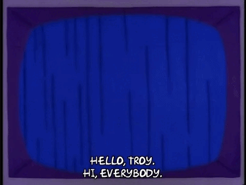

<head>
  <link rel="stylesheet" type='text/css' href="https://cdn.jsdelivr.net/gh/devicons/devicon@latest/devicon.min.css" />
</head>
<header>
  <h1>👋 Hi, everybody!</h1>
</header>
<body>
  

    
  

  <h2>💻 Tools and Technologies</h2>
  

    
    
    
    
    
    
    
    
    
    
    
    
  

  <h2>📚 I'm Learning</h2>
  

    
    
    
    
       
  

  <section>
  <h2>💬 Contact</h2>
    
  

<a href="https://github.com/seu-usuário-aqui">

   <h2>📊 Stats</h2>
  

    
  

</section>

  
  
  <ul>
    <li><h3>🙋🏽 Me:</h3> I'm Luan Henrique, a 24-year-old web developer passionate about solving complex problems and continuously expanding my skill set. With experience in both front-end and back-end technologies, I’ve worked on a variety of projects, including e-commerce development and full-stack applications. My journey into web development has driven me to seek efficient, impactful solutions through code.</li>
    <li><h3>🏔️ Obstacles:</h3>Every day presents new challenges, and I've learned that what seems "impossible" is often just a matter of time and persistence. Tackling obstacles head-on has taught me that continuous effort transforms once-difficult tasks into second nature. It's this relentless drive that fuels my love for programming..</li>
    <li><h3>🏆 Wins:</h3>From building a complete e-commerce platform with Shopify to developing social media-like and newsletter applications using React and Node.js, I've gained hands-on experience delivering full-stack solutions. What once seemed unattainable eventually becomes achievable through determination and learning. Each project I complete is a testament to the idea that progress comes with perseverance.</li>
    <li><h3>🚀 Future:</h3>From building a complete e-commerce platform with Shopify to developing social media like and newsletter applications using React and Node.js, I've gained hands-on experience delivering full-stack solutions. What once seemed unattainable eventually becomes achievable through determination and learning. Each project I complete is a testament to the idea that progress comes with perseverance.</li>
  </ul>

  
  
</body>

<!--
**Lhenrick/Lhenrick** is a ✨ _special_ ✨ repository because its `README.md` (this file) appears on your GitHub profile.

Here are some ideas to get you started:

- 🔭 I’m currently working on ...
- 🌱 I’m currently learning ...
- 👯 I’m looking to collaborate on ...
- 🤔 I’m looking for help with ...
- 💬 Ask me about ...
- 📫 How to reach me: ...
- 😄 Pronouns: ...
- ⚡ Fun fact: ...
-->
